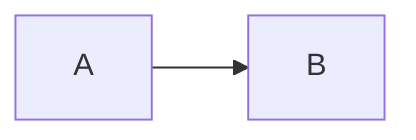
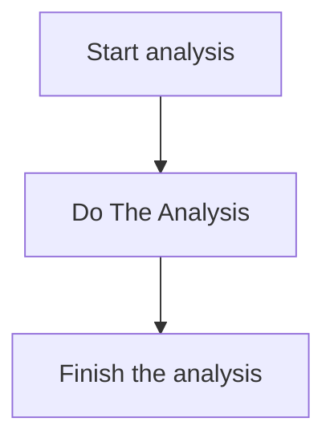
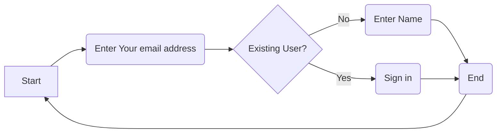

Flow Chart Left to Right

You can assign text to a rectangle and also reference that rectangle
with just the letter (etc. B[Hello] Displays Hello but you can refer to it with B).

Different types of diagrams:
